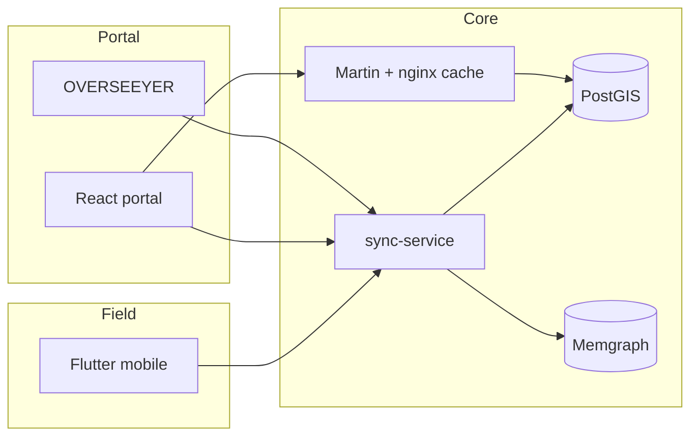

<p align="center">
  
</p>

<p align="center">
  <strong>Grid Intelligent Operating Platform</strong> for Ghana ECG / NEDCo — national GIS stewardship, topology data quality, field-to-master promotion, and an AI map copilot.
</p>

<p align="center">
  <a href="#-quick-start"></a>
  <a href="docs/giop_technical_architecture.md"></a>
  <a href="overseeyer/README.md"></a>
</p>

<p align="center">
  
  
  
  
  
</p>

---

## Why GIOP

GIOP is a **stewardship platform**, not just a map viewer:

| Principle | What it means |
|-----------|----------------|
| **Postgres is truth** | CIM master in `public`, field/import in `staging` / `gis` |
| **Promote before publish** | Captures stay off the national map until approved |
| **Martin serves the map** | Vector tiles from `map_*` layers — not full graph dumps |
| **Memgraph is derived** | Trace / impact only; reconciled from Postgres |
| **Humans approve writes** | Agents recommend; policy gates block silent mutations |



---

## ⚡ Quick start

**One command** — health-check and start anything offline:

```bash
chmod +x scripts/start_giop_stack.sh
./scripts/start_giop_stack.sh                 # start missing services
./scripts/start_giop_stack.sh --check-only    # status only
./scripts/start_giop_stack.sh --portal        # + React portal :5173
./scripts/start_giop_stack.sh --bootstrap     # reconcile Memgraph
```

<details>
<summary><strong>Manual start (click to expand)</strong></summary>

1. **Supabase** (Postgres + REST + Realtime)
   ```bash
   npx supabase start
   npx supabase db reset   # applies migrations
   ```

2. **Supporting containers**
   ```bash
   docker start my-memgraph giop-martin giop-timescale giop-redis
   .venv/bin/python memgraph/bootstrap.py
   ```
   Redis is optional but recommended (`REDIS_URL`). After `db reset`, always re-run Memgraph bootstrap.

3. **Python services**
   ```bash
   cd sync-service && uvicorn main:app --host 0.0.0.0 --port 5000 --reload
   cd ocr-service && uvicorn main:app --host 0.0.0.0 --port 5002 --reload
   ```

4. **GIOP Portal**
   ```bash
   cd "backoffice-ui/cloudhound frontend portal"
   cp .env.local.example .env.local
   npm install && npm run dev   # http://localhost:5173
   ```
   Optional Martin cache: `VITE_MARTIN_URL=http://127.0.0.1:3002` after `./scripts/ensure_martin_cache.sh`.

5. **Mobile**
   ```bash
   cd mobile && flutter run
   ```

</details>

Logs / PIDs: `.giop/logs/`, `.giop/pids/`

---

## 🗺️ Stack at a glance

| Service | Port | Role |
|---------|------|------|
| GIOP Portal | `5173` | Map, DQ, ops, AI copilot |
| sync-service | `5000` | API gateway |
| Martin / nginx cache | `3001` / `3002` | Vector tiles |
| Supabase Postgres | `54322` | CIM + GIS + DQ |
| Memgraph | `7687` | Topology graph |
| Redis | `6379` | API / scan cache |
| TimescaleDB | `5433` | Meter intervals |
| OVERSEEYER | `5191` | Dev control plane |
| ocr-service | `5002` | Meter OCR |

---

## Staging → master

Field captures land in **`staging`**. They do **not** appear on the map or in Memgraph until approval.

| Tier | Schema | Map / Memgraph | Validation |
|------|--------|----------------|------------|
| Staging | `staging.*` | Hidden | `PENDING_FIELD`, `STAGED`, `IN_CONFLICT` |
| Master | `public.*` | Visible | `APPROVED` (after promote) |

Approve calls `promote_staged_asset()` → copies into `public.*`, removes from staging. Graph webhooks fire only on **public** changes.

---

## 🛰️ OVERSEEYER

Local control plane — stack health, start/stop/restart, migrations, map-tile verify. **Not** part of the portal UI.

```bash
chmod +x overseeyer/scripts/start.sh
./overseeyer/scripts/start.sh
```

- UI → http://127.0.0.1:5191  
- API → http://127.0.0.1:5190/api/observability  

Includes **`martin-cache`** (nginx tile cache on `:3002`). Full reference: [`overseeyer/README.md`](overseeyer/README.md).

---

## 📡 Key APIs (sync-service `:5000`)

<details>
<summary><strong>Assets, topology, field</strong></summary>

| Endpoint | Purpose |
|----------|---------|
| `GET /api/v1/assets/staging` | Pending field assets |
| `GET /api/v1/assets/master?bbox=` | Master assets in bbox |
| `POST /api/v1/field/nodes` | Field capture → staging |
| `POST /api/v1/topology/repair` | Repair by MRID |
| `PATCH /api/v1/assets/{mrid}/validation` | Approve → promote |
| `GET /api/v1/graph/chunk?bbox=` | Viewport subgraph |
| `GET /api/v1/health/metrics` | APM latency / errors |

</details>

<details>
<summary><strong>Ops modules (cases, tickets, work orders, outages)</strong></summary>

| Endpoint | Purpose |
|----------|---------|
| `GET/POST /api/v1/cases` | Contact centre intake |
| `GET/POST /api/v1/tickets` | Trouble tickets |
| `GET/POST /api/v1/work-orders` | Dispatch board |
| `GET /api/v1/work-orders/assigned?user=` | Mobile assignments |
| `GET/POST /api/v1/outages` | Outage tracking |
| `GET /api/v1/regulatory/metrics` | SAIDI / SAIFI / CAIDI |

```bash
chmod +x scripts/verify_ops_modules.sh
./scripts/verify_ops_modules.sh
```

</details>

<details>
<summary><strong>Inspections, lineage, DLQ, energy</strong></summary>

| Endpoint | Purpose |
|----------|---------|
| `POST /api/v1/inspections` | Field inspection + OCR |
| `GET /api/v1/lineage?asset_mrid=` | Audit lineage |
| `GET /api/v1/dlq` | Integration dead-letter queue |
| `GET /api/v1/schematic/generate?mrid=` | SVG schematic |
| `POST /api/v1/analytics/energy-accounting/balance` | Feeder balance |

</details>

---

## 📦 Power System GeoPackage

Place `supabase/Power System.gpkg` locally (**not** committed; ~1.7 GB):

```bash
chmod +x scripts/import_power_system_gpkg.sh
./scripts/import_power_system_gpkg.sh
./scripts/promote_topology.sh
.venv/bin/python memgraph/bootstrap.py
./scripts/verify_topology.sh
```

Meters (~1.25M) are skipped by default — set `IMPORT_METERS=1` to include them.

---

## 📚 Docs

| Doc | Topic |
|-----|--------|
| [`docs/giop_technical_architecture.md`](docs/giop_technical_architecture.md) | Runtime architecture |
| [`docs/data_scale_architecture.md`](docs/data_scale_architecture.md) | Scale & caching strategy |
| [`docs/map_implementation_checklist.md`](docs/map_implementation_checklist.md) | Map / Martin checklist |
| [`docs/giop_ai_implementation.md`](docs/giop_ai_implementation.md) | AI / voice / endpoint swarm |

---

## Architecture parity

| Module | Feature | Status |
|--------|---------|--------|
| 2 | Staging → master promote, repair, Memgraph | Done |
| 3 | Immutable lineage ledger | Done |
| 4 | Offline conflict detection | Done |
| 5 | Field inspections + OCR | Done |
| 6 | Spot-bill + telemetry ingest | Done |
| 7 | Martin SLD tiles + viewport topology | Done |
| 8 | Schematic SVG + energy accounting | Done |
| 10 | Portal lineage, DLQ, APM | Done |
| 12–16 | Work orders, cases, tickets, outages, SAIDI | MVP |
| 1 | Docker Compose / Kafka brokers | Deferred |

---

## Production portal

```bash
cd "backoffice-ui/cloudhound frontend portal"
npm run build
# nginx.conf.example — /api/v1 → :5000, /ocr-api → :5002
```

Optional tracing:

```bash
export OTEL_SERVICE_NAME=giop-sync-service
export OTEL_EXPORTER_OTLP_ENDPOINT=http://127.0.0.1:4318
```

---

<p align="center">
  <sub>Built for Ghana grid operations · map fast · promote carefully · ask before you write</sub>
</p>
