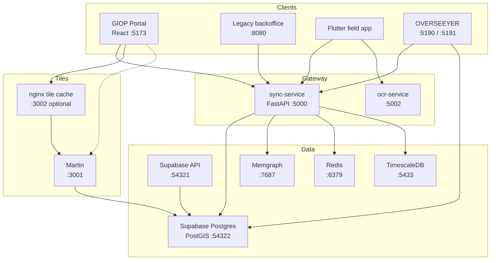
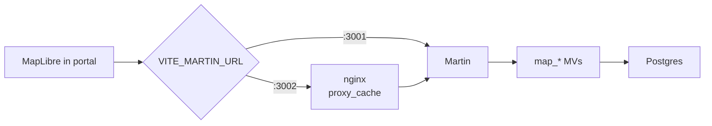

# GIOP Technical Architecture Breakdown

**Grid Intelligent Operating Platform (GIOP)**  
Local MVP for the Ghana power system (ECG / NEDCo): national GIS stewardship, topology data quality, field-to-master promotion, and AI-assisted operations.

| | |
|---|---|
| **Audience** | Engineers onboarding to the monorepo |
| **Scope** | Runtime architecture, data plane, APIs, caching, DQ/map paths |
| **Related docs** | [`docs/data_scale_architecture.md`](data_scale_architecture.md), [`docs/map_implementation_checklist.md`](map_implementation_checklist.md), [`docs/giop_ai_implementation.md`](giop_ai_implementation.md), [`README.md`](../README.md) |
| **As of** | July 2026 |

---

## 1. Purpose and design principles

GIOP is a **stewardship platform**, not a pure viewer:

1. **Postgres + PostGIS is the system of record** (CIM master in `public`, field/import in `staging` / `gis`).
2. **Promote before publish** — field captures and GIS imports do not appear on the national map or Memgraph until approved.
3. **Martin serves the map** — vector tiles from precomputed `map_*` layers; the Map tab does not stream full graph chunks.
4. **Memgraph is a derived graph** — used for path/trace/impact; reconciled from Postgres, not authoritative.
5. **Humans approve mutations** — agents and LLMs recommend; policy gates block unapproved writes.

---

## 2. High-level system context



**Primary user path (map):** browser → Martin (or nginx → Martin) → `map_*` MVs in Postgres.  
**Primary user path (DQ / ops / AI):** browser → sync-service → Postgres / Redis / Memgraph / LLMs.

---

## 3. Monorepo layout

| Path | Responsibility |
|------|----------------|
| `sync-service/` | FastAPI gateway: map APIs, DQ/topology, GIS import/promote, agents, ops modules |
| `backoffice-ui/cloudhound frontend portal/` | Primary React portal (Vite) |
| `backoffice-ui/` (root) | Legacy static UI |
| `mobile/` | Flutter field capture + offline queue |
| `ocr-service/` | PaddleOCR meter photo extraction |
| `overseeyer/` | Dev control plane (health, migrations, service control) |
| `supabase/` | Migrations, seed, Edge Functions, `config.toml` |
| `memgraph/` | Bootstrap / full reconcile from Postgres |
| `config/` | Martin YAML, nginx tile cache, Avro schemas |
| `scripts/` | Stack start, `ensure_*.sh`, import/verify helpers |
| `docs/` | Architecture and implementation notes |
| `timescaledb/` | Meter readings hypertable init |

---

## 4. Runtime services

Orchestration: `./scripts/start_giop_stack.sh`  
Logs / PIDs: `.giop/logs/`, `.giop/pids/`

| Service | Port | Role | Start |
|---------|------|------|-------|
| Supabase API | `54321` | PostgREST / Auth / Realtime | `npx supabase start` |
| Supabase Postgres | `54322` | CIM + GIS + DQ | same |
| sync-service | `5000` | Application API gateway | uvicorn in stack script |
| ocr-service | `5002` | Meter OCR | uvicorn |
| Martin (`giop-martin`) | `3001` | MVT from PostGIS | `scripts/ensure_martin.sh` / OVERSEEYER `martin` |
| nginx Martin cache | `3002` | HTTP tile cache | `scripts/ensure_martin_cache.sh` / OVERSEEYER `martin-cache` (`GIOP_MARTIN_CACHE=0` to skip in stack start) |
| Memgraph | `7687` | Topology graph | Docker `my-memgraph` |
| TimescaleDB | `5433` | Interval / meter readings | Docker `giop-timescale` |
| Redis | `6379` | API cache, locks, scan progress | `scripts/ensure_redis.sh` |
| GIOP portal | `5173` | React backoffice | `--portal` |
| Legacy UI | `8080` | Static fallback | `--backoffice` |
| OVERSEEYER API / Web | `5190` / `5191` | Stack control UI | `overseeyer/scripts/start.sh` |

Portal Martin URL (local):

- Direct: `VITE_MARTIN_URL=http://127.0.0.1:3001`
- Cached: `VITE_MARTIN_URL=http://127.0.0.1:3002`

---

## 5. Data plane

### 5.1 Schemas

| Schema | Role |
|--------|------|
| **`public`** | Master CIM: `identified_objects`, `connectivity_nodes`, `ac_line_segments`, conducting equipment, DQ tables, ops modules |
| **`staging`** | Pre-approval field / capture assets and staging DQ exceptions |
| **`gis`** | GIS import runs, conductor segments, asset ID map, overview layers, admin boundaries |

PostgREST exposes `public`, `staging`, and `gis` (see `supabase/config.toml`).

### 5.2 Approximate national scale (local Ghana load)

| Layer | Order of magnitude |
|-------|-------------------|
| `ac_line_segments` | ~1.1M |
| `connectivity_nodes` | ~0.9M |
| `connected_node_mrids` | ~0.4M distinct endpoints |
| Map MVs | Same order as master geoms |

### 5.3 Important materialized views / caches

| Object | Purpose |
|--------|---------|
| `map_connectivity_nodes` | Martin node tiles (prejoined) |
| `map_ac_line_segments` | Martin line tiles + `length_m` / installation type |
| `map_power_transformers` | DT/PT symbols |
| `map_unpromoted_conductor_segments` | Gap / unpromoted overlay |
| `connected_node_mrids` | Fast orphan anti-join set |
| `topology_scan_cache_meta` | Age-aware refresh timestamps for connected-node + map MVs |
| `gis.district_asset_counts_master` | District rollups for copilot / inventory |

### 5.4 Promote pipeline (conceptual)

```text
GIS import / field capture
        │
        ▼
  staging / gis.*
        │  steward approve / promote RPCs
        ▼
  public CIM (master)
        │
        ├── refresh_connected_node_mrids(0)
        ├── refresh_map_tile_layers(0)
        ├── Memgraph reconcile
        └── map cache invalidate (?v= / Redis)
```

Promote entry: `gis.promote_topology_to_cim()` (composed in migrations; forced map + connected-node refresh with max-age `0`).

### 5.5 Memgraph

- **Not** the source of truth.
- Holds nodes/edges for trace, impact, and graph chunk queries.
- Full reconcile: `memgraph/bootstrap.py` (`start_giop_stack.sh --bootstrap`).
- Incremental: sync-service graph sync + optional Edge Function `memgraph-sync`.

---

## 6. Map architecture



| Concern | Implementation |
|---------|----------------|
| Tile generation | Martin + `config/martin.yaml` |
| Heavy joins off tile path | `00100` map MVs |
| In-process tile reuse | Martin `cache.size_mb: 1024` |
| Cross-restart HTTP reuse | nginx on `:3002` |
| Zoom bands | Per-layer `minzoom` / `maxzoom` in Martin + portal layer filters (**do not change casually**) |
| Refresh after promote | `refresh_map_tile_layers(0)`; age-aware skip for non-promote callers (`00106`) |

**Anti-patterns already rejected** (see `docs/data_scale_architecture.md`): bulk-dropping valid lines for “lighter tiles,” graph-chunk on Map tab, experimental Martin clip that broke rendering.

---

## 7. Topology data quality architecture

Master **Scan → queue** lives in `sync-service/topology_dq.py` (+ geometric rules in `geometric_topology.py`).

### 7.1 Phases

1. Refresh connected-node cache (age-aware; default 6h skip)
2. Auto-clear resolved OPEN exceptions (exception-table driven)
3. Orphans → dangling → unapproved endpoints (set-based upserts)
4. Geometric rules (district-scale only; **national geom skipped**)
5. Snapshot live counts + export gate

### 7.2 Performance posture (current)

| Technique | Effect |
|-----------|--------|
| Anti-join dangling / unapproved | ~6–7× faster than per-row `EXISTS` |
| National orphan insert cap (`TOPOLOGY_ORPHAN_INSERT_CAP`, default 10k) | Full `found` count kept; queue not flooded |
| Age-aware `refresh_connected_node_mrids` | Avoid multi-minute MV rebuild every scan |
| National geometric skip | Removes hours-scale geography work from national path |
| Slim `data_quality_exceptions` | Reindex + `VACUUM FULL` after aborted mega-inserts |

Cancel / progress: Redis progress keys + `POST .../dq/topology/runs/{id}/cancel`.

---

## 8. sync-service API domains

Base: `http://127.0.0.1:5000`

| Domain | Prefix examples |
|--------|-----------------|
| Map / spatial | `/api/v1/map/*`, `/api/v1/h3/*`, `/api/v1/reference-layers/*` |
| Graph | `/api/v1/graph/*`, `/api/v1/trace`, `/api/v1/topology/*` |
| DQ / topology scan | `/api/v1/dq/*`, `/api/v1/dq/topology/*` |
| GIS / endpoint fix | `/api/v1/gis/*` |
| Assets / field | `/api/v1/assets/*`, `/api/v1/field/*` |
| Agents / validation | `/api/v1/validation/*`, `/api/v1/agents/*`, `/api/v1/approvals/*` |
| Portal AI | `/api/v1/portal/ai/*` |
| Import / export | `/api/v1/imports/*`, `/api/v1/migration/*`, `/api/v1/exports/*` |
| Ops | `/api/v1/cases`, `/tickets`, `/work-orders`, `/outages` |
| Health | `/api/v1/health/metrics` |

---

## 9. Frontend (portal)

**Path:** `backoffice-ui/cloudhound frontend portal/`  
**Stack:** React 19 + TypeScript + Vite + MapLibre

### Navigation groups (`GiopPortal.tsx`)

| Group | Tabs |
|-------|------|
| Grid | Map, Topology, Map + Topology, Schematic |
| Assets & data | Operations, Energy insights, Meter OCR, DLQ, Audit, Data quality, CIM export, GIS references, Migration |
| Service desk | Cases, Tickets, Work orders, Outages, Reports |

Global: enhanced copilot, APM widget, map search / tools overlays.

---

## 10. AI and agents

Package: `sync-service/agents/`

- Orchestrator / validator / graph / queue / cleanup / proposal / approval agents
- Steward LLM (ReAct tools) for portal chat and voice
- **Policy gate:** models recommend; writes require approval
- Endpoint-fix AI scans under `/api/v1/gis/endpoint-fix-proposals/ai-scan*`
- Optional voice: OpenAI STT + Supertonic TTS (`:7788`)

Details: `docs/giop_ai_implementation.md`, `sync-service/agents/README.md`.

---

## 11. Caching layers (who caches what)

| Layer | Stores | Does **not** store |
|-------|--------|--------------------|
| **Redis** | Graph chunks, map-config, geocode/search, places index, DQ scan progress, locks, ops badges | Martin `.pbf` tile bytes |
| **Martin memory** | Hot z/x/y tiles | Cross-process / post-restart tiles |
| **nginx `:3002`** | HTTP responses for catalog + tiles | Application JSON APIs |
| **Browser sessionStorage (SWR)** | Last `map-config` + places index for instant remount | Tile geometry |
| **Browser localStorage** | Last map camera (center/zoom/bearing/pitch) | Tile geometry |

Invalidate after promote: `POST /api/v1/map/invalidate-cache` (+ portal `?v=` on tile sources).

---

## 12. Migrations

- **Directory:** `supabase/migrations/`
- **Naming:** `000NN_slug.sql` … currently through `00106_*`
- **Apply local:** `npx supabase migration up --local` (or OVERSEEYER migrations UI)
- **Avoid:** `db reset` unless you intend to wipe local data

Notable recent migrations:

| Migration | Topic |
|-----------|--------|
| `00100` | Map tile MVs |
| `00105` | Topology scan / connected-node age-aware refresh |
| `00106` | Map tile layer age-aware refresh |

---

## 13. Security and tenancy notes (local MVP)

- Local Supabase demo keys in `.env` / portal `.env.local` — **not** production secrets.
- `service_role` used by sync-service for privileged SQL / SECURITY DEFINER functions.
- RLS exists on many tables; sync-service typically uses the DB URI with elevated rights.
- Treat Edge Functions (`telemetry`, `memgraph-sync`) as optional glue, not the core path.

---

## 14. Operational runbook (minimal)

```bash
# Bring stack up
./scripts/start_giop_stack.sh --portal

# Map tiles + optional HTTP cache
./scripts/ensure_martin.sh
./scripts/ensure_martin_cache.sh   # :3002

# After schema changes
npx supabase migration up --local
./scripts/verify_map_tile_views.sh

# After promote / large data change
.venv/bin/python memgraph/bootstrap.py   # or stack --bootstrap
curl -X POST 'http://127.0.0.1:5000/api/v1/map/invalidate-cache?refresh_h3=true'
```

Postgres Docker `/dev/shm`: use `scripts/patch_supabase_db_shm.sh` after `supabase start` if large parallel queries fail with shared-memory errors.

---

## 15. Architecture decision summary

| Decision | Choice | Rationale |
|----------|--------|-----------|
| Map serving | Martin + map MVs | Avoid live CIM joins per tile |
| Graph analytics | Memgraph sidecar | Fast path queries; Postgres remains SoR |
| National DQ geom | Skip on national clip | Geography over ~1M lines is hours-scale |
| Orphan queue | Cap national inserts | Steward queue usability + lock time |
| Tile HTTP cache | Optional nginx | Complements Martin memory; Redis is for APIs |
| Warehouse / columnar | Not required yet | Scale is national GIS, not multi-billion analytics |

---

## 16. Document map

| Doc | Use when |
|-----|----------|
| This file | Whole-system architecture |
| `docs/data_scale_architecture.md` | Scale numbers, map perf phases, rollbacks |
| `docs/map_implementation_checklist.md` | Map feature checklist |
| `docs/giop_ai_implementation.md` | LLM / swarm / endpoint AI |
| `docs/latency_phases.md` | Latency budgeting |
| `architecture.txt` | Older bootstrap narrative (may lag code) |

---

*Generated from the ECG monorepo structure and migrations as of July 2026. Update this document when ports, schemas, or promote contracts change.*
